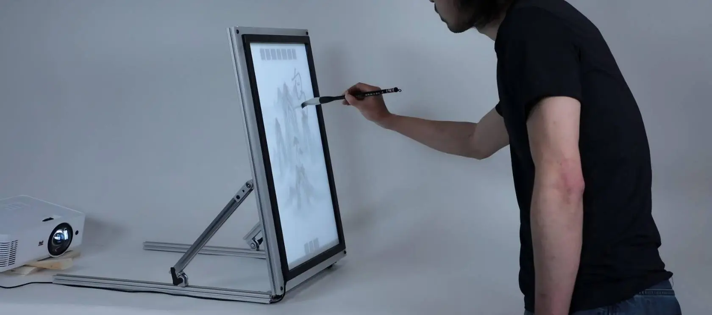
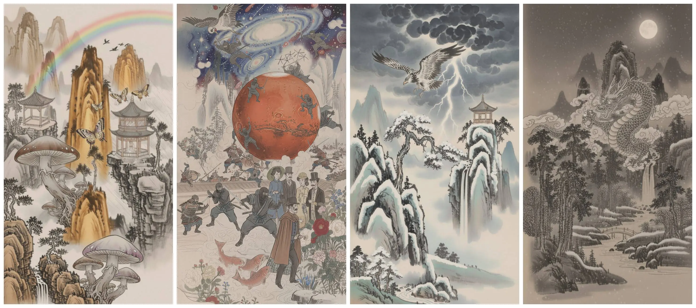
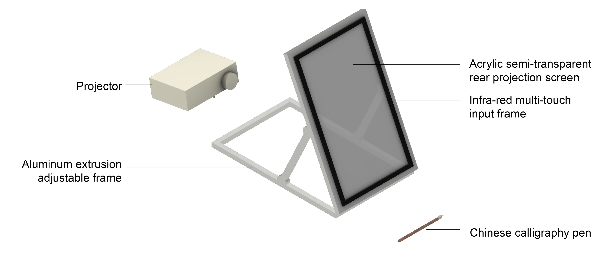

# Dream Brush

Generate Chinese tradition painting from location-aware calligraph input

- [Demo video 1](https://www.youtube.com/watch?v=FUGcTMSbbyM)
- [Demo video 2](https://www.youtube.com/watch?v=PR9V12ORtWY)

## Intro

Dream Brush (2026) is an interactive AI painting installation where visitors write Chinese characters with a water brush on a physical canvas. Instead of typing prompts from a distance, participants create through embodied calligraphic gestures: what they write, where they place it, how large it is, and how it is oriented all become part of the evolving composition. The project draws on the historical continuity between Chinese writing and painting, treating each character as both a meaningful word and a pictorial mark. As the brushstroke fades like drying water, the system responds with new imagery and sound, creating a rhythm of inscription, waiting, and reveal. Designed for public interaction, Dream Brush invites individuals and groups to improvise together, negotiate what to write next, and experience generative AI as a shared encounter between cultural practice, physical gesture, and machine interpretation.

## Art style

The generated paintings blend Chinese ink-wash landscapes with playful, dreamlike motifs, turning written characters into layered visual worlds. Mountains, pavilions, mist, birds, mushrooms, butterflies, rainbows, planets, ninjas, flowers, and figures accumulate across the canvas, preserving the compositional logic of calligraphy while allowing unexpected images to emerge through AI generation. Each artwork is a temporal compression of the human-AI co-creation process.

## System implementation

Dream Brush is built as a rear-projected tangible interface: an acrylic semi-transparent screen is mounted on an adjustable aluminum easel, with an infrared multi-touch frame detecting the water-brush strokes on the canvas surface. A projector displays the live fading trace and generated painting from behind the screen, while the computer pipeline recognizes each handwritten Chinese character, uses its position and scale to guide localized image generation, and triggers corresponding sound.

- AI system designer: [Sun Chuanqi][1]
- Hardware designer: [Yuhan Wang][2]
- Project contributor: [Quincy Kuang][3]
- Research advisor: [Hiroshi Ishii][4]
- Text/Image Generative AI: gemini-2.5-flash-image
- Sound effects: ElevenLabs
- Background music: Suno
- Source code: [GitHub][5]

[1]: https://www.linkedin.com/in/chuanqi-sun/
[2]: https://www.linkedin.com/in/yuhan-wang-095874264/
[3]: https://www.quincykuang.com/
[4]: https://tangible.media.mit.edu/person/hiroshi-ishii/
[5]: https://github.com/chuanqisun/dream-brush
